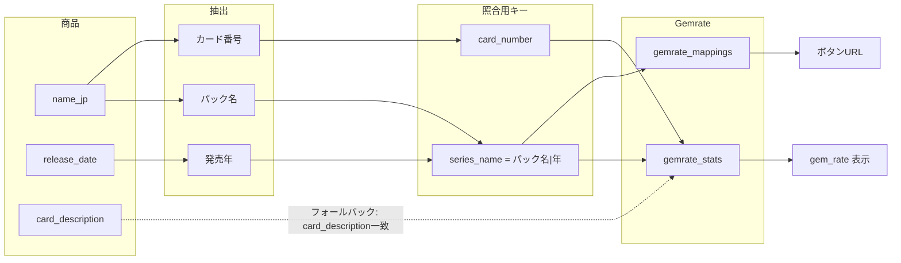

# PSA10取得率を Gemrate 鑑定データ連携に変更する設計

## 確認事項への回答（反映済み）

1. **gemrate_mappings**: すでに Supabase 上に存在する。新規作成は不要。既存テーブルを参照する。
2. **フォールバック照合**: **gemrate_stats.card_description** と **products.card_description** を一致させる。
3. **name_jp フォーマット**: 現時点ではワンピース・ポケモンの2形式のみ実装。他フォーマットは新たに判明した時点で相談のうえ対応する。

---

## 目標

- **PSA10取得率**を「取引に占めるPSA10の割合」ではなく、**Gemrateの鑑定実績（gem_rate）**で表示する。
- 商品（products）と鑑定データ（gemrate_stats）を、**name_jp と release_date から抽出した情報**で紐付ける。
- 紐付けに失敗した商品は、**商品詳細で card_description を編集**してマッピングを修正できるようにする。
- **「Gemrateで取得率を確認する」ボタン**のURLを、**gemrate_mappings**（series_name → URL）で参照する。

---

## データの流れ（概要）

---

## 1. 利用するSupabaseデータ

| テーブル | 役割 | 主なカラム |
|----------|------|------------|
| **gemrate_stats** | PSA10鑑定実績（既存） | series_name, card_number, card_description, gem_rate, psa10_count, total_graded 等 |
| **gemrate_mappings** | パック（series_name）→ GemrateページURL（**既存**） | series_name（または pack_key）, gemrate_url |
| **products** | 商品マスタ（既存） | name_jp, release_date, card_description（編集可能にする） |

- **gemrate_stats.series_name** の形式: `"パック名|発売年"`（例: `シャイニートレジャーex|2023`）。
- **gemrate_stats.card_number**: カード番号（例: `120`, `240`）。
- **フォールバック**: **gemrate_stats.card_description** と **products.card_description** を一致させて照合する。

---

## 2. name_jp からの抽出ルール

実装は共通ユーティリティ（例: `utils/gemrateParse.ts`）にまとめる。**現時点ではワンピース・ポケモンの2形式のみ対応**。他フォーマットは判明次第相談して追加する。

**ワンピース例**  
`サボ：手配書 SEC-SPC [OP13-120](ブースターパック「受け継がれる意志」)`

- **カード番号**: `[OP13-120]` の数字部分 → **120**。
- **パック名**: `(…)` 内の `「…」` の内容 → **受け継がれる意志**。

**ポケモン例**  
`メガゲンガーex SAR [M2a 240/193](ハイクラスパック「MEGAドリームex」)`

- **カード番号**: `[M2a 240/193]` のスラッシュ前の数字 → **240**。
- **パック名**: `(…)` 内の `「…」` の内容 → **MEGAドリームex**。

**発売年**: **release_date** から [utils/formatReleaseDate.ts](utils/formatReleaseDate.ts) の `parseReleaseDateToYear` で取得（例: `2025-11-28` → `2025`）。

**照合用 series_name**: 抽出した **パック名 + "|" + 発売年**（例: `受け継がれる意志|2025`, `MEGAドリームex|2025`）。

---

## 3. 商品 ↔ gemrate_stats の照合

1. **第一優先**: 抽出した `(series_name, card_number)` で **gemrate_stats** を検索（両方一致）。一致した行の **gem_rate** をPSA10取得率として表示。
2. **フォールバック**: 一致しない場合、**products.card_description** が入力されていれば **gemrate_stats.card_description** と一致する行を検索し、その **gem_rate** を表示。
3. どちらも一致しなければ PSA10取得率は「—」表示。

---

## 4. 商品詳細ページの変更

- **PSA10取得率**: 上記で取得した **gemrate_stats.gem_rate** を表示（%）。照合失敗時は「—」。
- **card_description の編集**: テキストボックスを設置し、保存時に **products** を UPDATE（Server Action または API Route）。
- **「Gemrateで取得率を確認する」ボタン**: 抽出した **series_name** で **gemrate_mappings** を検索し、`gemrate_url` があればそれを href に使用。なければ従来どおり `getGemrateUrl(appSettings, id, productCode)` にフォールバック。ボタンは「スニダンで見る」の近くに配置。

---

## 5. 一覧ページの変更

- **Stats.psa10Rate** を取引履歴ベースから **gemrate_stats.gem_rate** に差し替え。
- 表示対象商品について上記と同じ照合ロジックで gem_rate を取得し、psa10Rate に渡す。照合できない商品は psa10Rate = null（表示は「—」）。

---

## 6. 実装タスクの整理

| 項目 | 内容 |
|------|------|
| パース util | name_jp からパック名・カード番号を抽出（ワンピース／ポケモン形式）。parseReleaseDateToYear で年を取得。 |
| 照合 util | (product, gemrate_stats) を series_name + card_number で照合。失敗時は product.card_description と gemrate_stats.card_description で照合。 |
| 詳細ページ | PSA10取得率を gem_rate 表示に変更。card_description 入力＋保存。Gemrate ボタンは gemrate_mappings 優先。 |
| 一覧ページ | 表示対象商品について gemrate_stats を照合し、psa10Rate に gem_rate を渡す。 |
| gemrate_mappings | **既存テーブルをそのまま利用**。series_name で検索して gemrate_url を取得。 |

---

## 7. 補足

- **表記ゆれ**: series_name や card_number の前後スペース・全角数字などは、トリムや正規化をかけると安全。
- **既存 Gemrate 紐付け**: app_settings.gemrate_urls を残し、gemrate_mappings を優先して参照する形にすると、既存の商品ID／product_code ベースのURLも引き続き使える。
